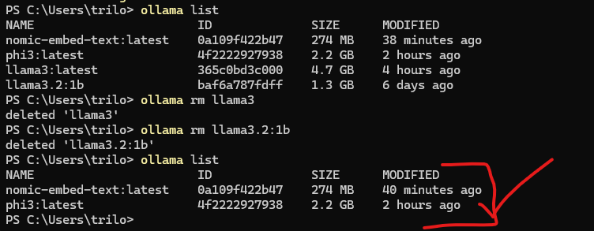
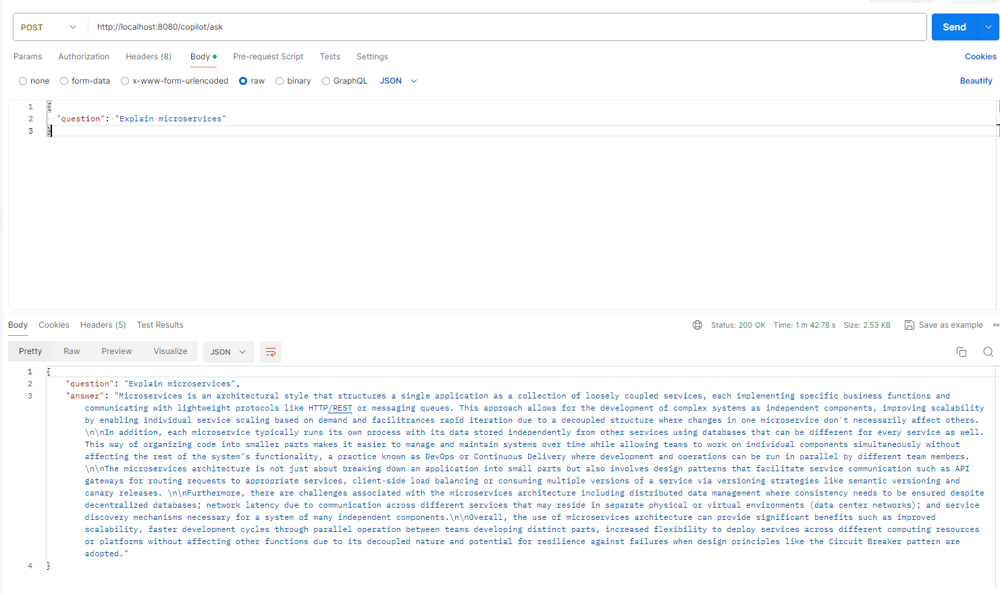
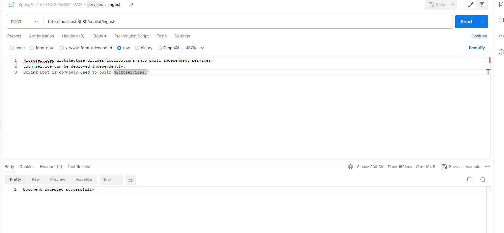

**AI Engineering Copilot using Spring AI + Ollama + pgvector**
Tech Stack: Java 21, Spring Boot, Spring AI, Ollama, PostgreSQL (pgvector), REST APIs, RAG Architecture, Vector Search


Architecture Diagram

## Architecture

AI Engineering Copilot
AI Engineering Copilot is a production-style backend system that integrates Spring Boot, Retrieval-Augmented Generation (RAG), and local LLMs to build an AI assistant capable of answering engineering questions using contextual knowledge.
The project demonstrates how modern AI-powered systems combine vector databases, embeddings, and large language models to create intelligent developer assistants.

Features
1. AI-powered question answering API
2. Integration with local LLM using Ollama
3. Supports models such as Phi-3 Mini
4. Vector search with pgvector
5. Retrieval-Augmented Generation (RAG) pipeline
6. PostgreSQL + pgvector running in Docker
7. Observability using Spring Boot Actuator and Micrometer
8. REST APIs for AI interaction

**Tech Stack**
Backend
Java 21
Spring Boot
Spring AI

AI
Ollama
Phi3 / Llama models

Database
PostgreSQL
pgvector

Infrastructure
Docker
Spring Boot Actuator
Micrometer / Prometheus

Example API
Ask AI Copilot
POST /copilot/ask
Request
{
 "question": "Explain microservice architecture"
}

Response
{
 "question": "Explain microservice architecture",
 "answer": "A microservice architecture is a design approach..."
}

Project Goals
This project demonstrates how to build an AI-powered engineering assistant capable of:
answering technical questions
retrieving relevant documents
using vector search with embeddings
generating context-aware responses
The long-term goal is to evolve this system into a developer productivity copilot capable of analyzing logs, runbooks, and engineering documentation.


setup

# Setup Instructions

```markdown
## Setup Instructions

### 1. Clone the Repository

```bash
git clone https://github.com/trilokee/ai-engineering-copilot.git
cd ai-engineering-copilot

2. Start PostgreSQL + pgvector (Docker)
docker run -d \
  --name pgvector \
  -e POSTGRES_USER=postgres \
  -e POSTGRES_PASSWORD=postgres \
  -e POSTGRES_DB=aicopilot \
  -p 5432:5432 \
  ankane/pgvector

3. Install Ollama

Download and install:

https://ollama.com

Start Ollama server:

ollama serve
4. Download AI Model

For low-memory systems:

ollama pull phi3
5. Configure application.yml
spring:
  datasource:
    url: jdbc:postgresql://localhost:5432/aicopilot
    username: postgres
    password: postgres

  jpa:
    hibernate:
      ddl-auto: update

  ai:
    ollama:
      base-url: http://localhost:11434
      chat:
        options:
          model: phi3
6. Run the Application
mvn spring-boot:run

Application starts at:

http://localhost:8080


### Project Structure


src/main/java/com/aicopilot

├── controller
│ CopilotController
│
├── service
│ CopilotService
│
├── rag
│ EmbeddingService
│ VectorSearchService
│
├── config
│ AIConfiguration
│
└── AiEngineeringCopilotApplication


---

### Core Components

| Component | Responsibility |
|--------|----------------|
CopilotController | REST endpoints for AI queries |
CopilotService | Orchestrates AI requests |
EmbeddingService | Generates vector embeddings |
VectorSearchService | Performs similarity search |
RAG Pipeline | Combines retrieval with generation |

---

### Development Workflow

1. Add documents to knowledge base  
2. Generate embeddings  
3. Store embeddings in pgvector  
4. Retrieve relevant documents  
5. Send context to LLM  
6. Generate response

Future Roadmap
## Future Roadmap

- Implement full RAG pipeline
- Document ingestion (PDF / Markdown)
- Log analysis AI agent
- Engineering knowledge base
- React UI for AI Copilot
- Streaming LLM responses
- Observability dashboards (Grafana)
- AI agents for debugging production issues

#Implement the RAG Pipeline
RAG has 4 stages:
1️⃣ Ingest documents
2️⃣ Generate embeddings
3️⃣ Store vectors in pgvector
4️⃣ Retrieve similar documents
5️⃣ Send context to LLM

#ollama list
ollama list


Connect to the Docker Database
Run:
docker exec -it pgvector psql -U postgres -d aicopilot
output:
aicopilot=#

#end point for local test


#how to add document chunks in vector db?
open docker desktop and open cmd terminal and run below command
docker exec -it pgvector psql -U postgres -d aicopilot

#verify if table is present
docker exec -it pgvector psql -U postgres -d aicopilot
#insert test data
INSERT INTO document_chunks (content, embedding)
VALUES
('Spring Boot is a Java framework for building microservices.', '[0.1,0.2,0.3,0.4]'),
('pgvector enables vector similarity search in PostgreSQL.', '[0.2,0.1,0.5,0.6]');

#note:(For quick testing the vector length doesn't matter; later your embedding service will insert real 768-dim vectors.)

SELECT * FROM document_chunks;
or ingest doc from api


#once ingestion done then ask question with ask api


#at this point this is the flow diagram
          +----------------+
          |   Documents    |
          +--------+-------+
                   |
                   v
         DocumentIngestionService
                   |
                   v
         EmbeddingService
         (nomic-embed-text)
                   |
                   v
            PostgreSQL
             + pgvector
                   |
                   v
          VectorSearchService
                   |
                   v
             RagService
                   |
                   v
               Ollama
                phi3
                   |
                   v
              Final Answer
